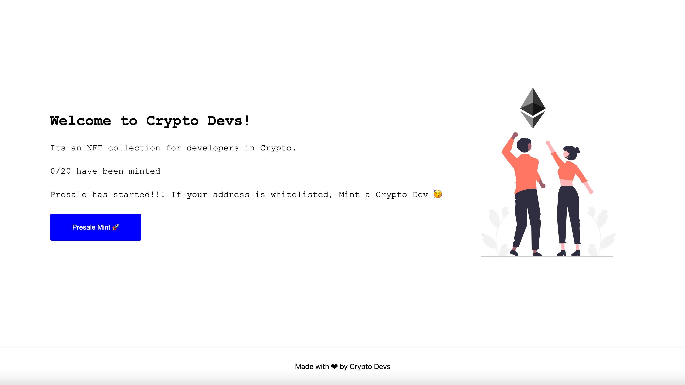
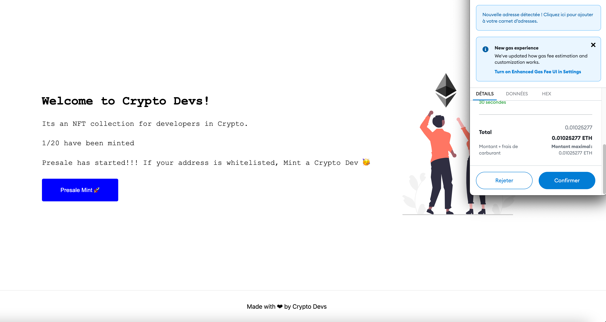

# Crypto Devs NFT Collection

Smart contract for the Crypto Devs NFT Collection. Built in Solidity on the Ethereum blockchain (Rinkeby Network) and is accessible at this address `0xcfA6EF95B7784534361698972A3d712Eb30a9E33`

👀 watch the Dapp live here : [https://nft-collection-front-seven.vercel.app/](https://nft-collection-front-seven.vercel.app/)

👀[Check the collection on Opensea here](https://testnets.opensea.io/collection/crypto-devs-lsiz9kzmyu)

👀[Check the first NFT of the collection on Opensea here](https://testnets.opensea.io/assets/0xcfA6EF95B7784534361698972A3d712Eb30a9E33/1)

### Stack

Backend :

- Solidity
- Hardhat

Fontend :

- Nextjs
- Hosted on Vercel
- Web3Modal
- ethers.js

### Front end code

[https://github.com/DumasOlivier/nft-collection-front](https://github.com/DumasOlivier/nft-collection-front)

### Requirements

- There should only exist 20 Crypto Dev NFT's and each one of them should be unique.
- User's should be able to mint only 1 NFT with one transaction.
- Whitelisted users, should have a 5 min presale period before the actual sale where they are guaranteed 1 NFT per transaction.
- There should be a website for your NFT Collection.

### Screenshots

